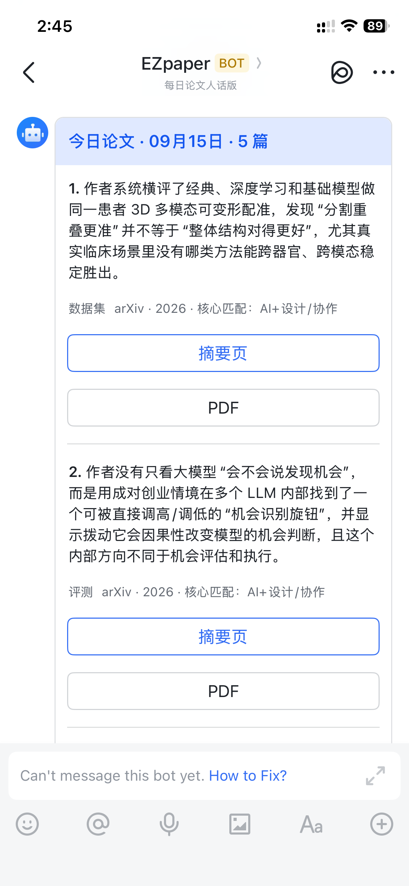
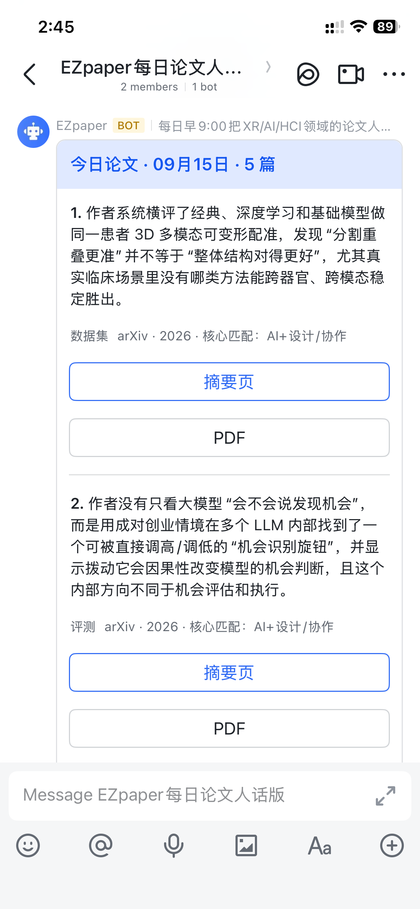

# EZpaper

> 每天自动从 arXiv 挑出与你研究方向最相关的论文，用一句中文讲清楚“它到底做了什么”，再把精选结果推送到飞书。

EZpaper 面向不想每天手动刷 arXiv 的研究者。它会完成 **抓取 → 去重 → 相关性筛选 → LLM 一句话总结 → 飞书卡片推送**，默认每天只留下 3–5 篇真正值得打开的论文。

## 效果展示

<table>
  <tr>
    <td align="center" width="50%">
      <br>
      <strong>自建应用：私聊推送</strong>
    </td>
    <td align="center" width="50%">
      <br>
      <strong>自定义机器人：群聊推送</strong>
    </td>
  </tr>
</table>

两种方式发送的是同一张论文卡片：每篇包含一句中文结论、来源与匹配理由，以及摘要页和 PDF 按钮。它是每日单向推送工具，不是问答聊天机器人。

## 它能做什么

- 按研究方向配置 arXiv 领域和关键词；
- 用核心相关性门槛过滤“只是沾了 AI 关键词”的弱相关论文；
- 自动识别同一论文的不同 arXiv 版本，避免重复推送；
- 调用 OpenAI 或 Anthropic，把摘要改写成一句易读的中文；
- 支持飞书群机器人 webhook 和自建应用单聊，两种渠道可任选或同时使用；
- 使用 GitHub Actions 定时运行，不需要自己的服务器或常开电脑；
- arXiv 偶发超时时自动重试，单个分类失败不会拖垮整份日报。

## 个人部署：四步开始

个人部署是推荐方式：论文方向、关键词、模型账号和飞书接收位置都由你自己控制。只想直接看维护者的共享推送、不想配置 GitHub Actions，也可以跳到文末的[加群交流](#加群交流)。

### 1. Fork 仓库

点击页面右上角 **Fork**，把 EZpaper 复制到自己的 GitHub 账号。

### 2. 填写飞书凭证和模型密钥

进入 fork 后的仓库：

`Settings → Secrets and variables → Actions → New repository secret`

最快的配置是“飞书群自定义机器人 + OpenAI”，只需添加两个 Secret：

| Secret | 填写内容 |
| --- | --- |
| `FEISHU_WEBHOOKS` | 飞书群自定义机器人的 webhook；多个地址用英文逗号分隔 |
| `OPENAI_API_KEY` | OpenAI API key |

#### 获取飞书群机器人 webhook

1. 新建一个飞书群；只给自己推送时，群里只有自己也可以；
2. 进入群设置，找到 **机器人 / 群机器人**，添加 **自定义机器人**；
3. 设置名称和描述，复制机器人生成的 webhook 地址；
4. 回到 GitHub，把完整地址保存为 `FEISHU_WEBHOOKS` secret；
5. 如果创建机器人时开启了“签名校验”，再把签名密钥保存为 `FEISHU_WEBHOOK_SECRET`。

群内所有成员都能看到 webhook 推送。飞书的用法和安全策略可参考[飞书 Webhook Bot 教程](https://www.feishu.cn/content/7271149634339422210)。webhook 相当于该群机器人的发送凭证，不要放进代码、截图、Issue 或 README。

#### 获取模型 API key

- **OpenAI（默认）**：登录 [OpenAI API key 页面](https://platform.openai.com/api-keys)，创建 secret key，并将它保存为 GitHub secret `OPENAI_API_KEY`。API 账户需要可用额度；首次使用可参考 [OpenAI 官方 Quickstart](https://developers.openai.com/api/docs/quickstart)。
- **Anthropic（可选）**：登录 [Claude Console API Keys](https://platform.claude.com/settings/keys) 创建 key，并将它保存为 GitHub secret `ANTHROPIC_API_KEY`；官方说明见 [Claude API overview](https://platform.claude.com/docs/en/api/overview#getting-api-keys)。只配置这一种 key 时，程序会自动选择 Anthropic。

如果同时配置了两种模型密钥，在 workflow 中运行 `python main.py` 的 `env` 区块添加 `SUMMARY_PROVIDER: openai` 或 `SUMMARY_PROVIDER: anthropic` 来明确指定。

#### 可选：改成自建应用私聊

如果想让机器人直接私聊发送，而不是发到群里，再按 [`files/README.md`](files/README.md) 的自建应用说明配置：

| Secret | 填写内容 |
| --- | --- |
| `FEISHU_APP_ID` | 飞书自建应用 App ID |
| `FEISHU_APP_SECRET` | 飞书自建应用 App Secret |
| `FEISHU_OPEN_IDS` | 接收人的飞书 `open_id`；多个用英文逗号分隔 |

只用私聊通道时不需要填写 `FEISHU_WEBHOOKS`；也可以同时配置两种通道，让同一份日报既发私聊又发群聊。

> 不要把真实 key、webhook 或 `.env` 提交到仓库。GitHub Actions 只从 repository secrets 读取这些值；ChatGPT/Claude 的普通订阅也不等同于 API key 或 API 额度。

### 3. 修改研究方向、推送数量和时间

编辑 [`.github/workflows/daily.yml`](.github/workflows/daily.yml) 中 `python main.py` 步骤的环境变量：

```yaml
ARXIV_CATEGORIES: "cs.HC,cs.AI,cs.LG,stat.ML,cs.CL,cs.CV,cs.GR,cs.RO"
KEYWORDS: "human-AI interaction,AI design,XR,virtual reality,user study"
MIN_RELEVANCE_SCORE: "4"
TOP_N: "5"
```

- `ARXIV_CATEGORIES`：要抓取的 arXiv 分类；
- `KEYWORDS`：你的领域、方法、对象和任务关键词；
- `MIN_RELEVANCE_SCORE`：越高越严格，推荐从 `4` 开始；
- `TOP_N`：每天最多推送多少篇。

默认配置针对 **HCI / Human-AI / XR / AI Design** 做了额外的核心相关性过滤。如果你的主题仍在这些方向内，通常只需替换分类和关键词。若研究主题完全不同（例如量子计算、材料或生物信息学），还应改为：

```yaml
REQUIRE_CORE_RELEVANCE: "0"
MIN_RELEVANCE_SCORE: "1"
```

自定义关键词默认每命中一个计 1 分，因此非默认领域建议先从 `MIN_RELEVANCE_SCORE: "1"` 测试，再根据结果逐步提高。关键词最好同时包含研究对象、方法、任务和常用缩写；arXiv 分类代码可在 [Category Taxonomy](https://arxiv.org/category_taxonomy) 查询。

默认每天北京时间 09:00 运行：

```yaml
on:
  schedule:
    - cron: "0 9 * * *"
      timezone: "Asia/Shanghai"
```

这里使用 IANA 时区名称；想改时间只需要修改 `cron` 和 `timezone`。可参考 [GitHub Actions 工作流语法](https://docs.github.com/en/actions/reference/workflows-and-actions/workflow-syntax#onschedule)。

### 4. 启用 GitHub Actions

fork 出来的仓库默认不会自动运行工作流：

1. 打开仓库的 **Actions** 页面；
2. 确认启用工作流；
3. 选择左侧 **daily-papers**；
4. 点击 **Run workflow** 做第一次测试。

GitHub 官方说明见 [Workflows in forked repositories](https://docs.github.com/en/actions/reference/workflows-and-actions/events-that-trigger-workflows#workflows-in-forked-repositories)。第一次成功后，日报会按设定时间自动发送。

成功标准：`check_config.py` 和 `main.py` 两步都是绿色，并且飞书收到卡片。定时任务可能因 GitHub Actions 排队比设定时间稍晚；这不代表配置失败。

## 配置说明

### 推送渠道

| 目标 | 必填配置 | 适合场景 |
| --- | --- | --- |
| 飞书群 | `FEISHU_WEBHOOKS` | 配置最快，多人共同接收 |
| 飞书私聊 | `FEISHU_APP_ID`、`FEISHU_APP_SECRET`、`FEISHU_OPEN_IDS` | 个人订阅或定向发送 |
| 两者同时 | 两组配置都填 | 同一份日报同时发到群和私聊 |

### 筛选参数

| 参数 | 默认值 | 说明 |
| --- | ---: | --- |
| `ARXIV_CATEGORIES` | `cs.HC,cs.AI,...` | arXiv 分类，英文逗号分隔 |
| `KEYWORDS` | 见 workflow | 研究兴趣关键词，英文逗号分隔 |
| `TOP_N` | `5` | 每次最多推送篇数 |
| `MIN_RELEVANCE_SCORE` | `4` | 相关性最低分数 |
| `REQUIRE_CORE_RELEVANCE` | `1` | 是否强制至少命中一个核心研究方向 |
| `MAX_PAPER_AGE_DAYS` | `14` | 只保留最近多少天的论文 |
| `ALLOW_REPEAT_PAPERS` | `0` | 临时设为 `1` 可忽略历史记录重新测试 |

### 摘要参数

| 参数 | 默认值 | 说明 |
| --- | ---: | --- |
| `SUMMARY_PROVIDER` | 自动选择 | `openai` 或 `anthropic`；未设置时按可用密钥选择 |
| `OPENAI_MODEL` | `gpt-5.5` | OpenAI 摘要模型 |
| `OPENAI_REASONING_EFFORT` | `low` | 推理强度 |

项目通过 OpenAI Responses API 调用 `gpt-5.5`；该模型支持 `low` reasoning effort，详见 [OpenAI 官方模型文档](https://developers.openai.com/api/docs/models/gpt-5.5)。如果账号无权使用该模型，可把 workflow 中的 `OPENAI_MODEL` 换成账号可用的文本模型。

### 网络容错参数

| 参数 | 默认值 | 说明 |
| --- | ---: | --- |
| `ARXIV_REQUEST_TIMEOUT_SECONDS` | `45` | 单次 arXiv 请求超时 |
| `ARXIV_RETRY_ATTEMPTS` | `3` | 每个分类最多尝试次数 |
| `ARXIV_RETRY_BACKOFF_SECONDS` | `5` | 重试退避的基础秒数 |

## 本地运行

需要 Python 3.11+。

```bash
git clone https://github.com/AlettaZhao/EZpaper.git
cd EZpaper/files
python -m pip install -r requirements.txt
cp .env.example .env
```

Windows PowerShell 可将最后一行换成：

```powershell
Copy-Item .env.example .env
```

填写 `.env` 后先检查配置：

```bash
python check_config.py
```

只预览、不发送：

```bash
DRY_RUN=1 python main.py
```

PowerShell：

```powershell
$env:DRY_RUN="1"
python main.py
```

更完整的本地调试和飞书自建应用说明见 [`files/README.md`](files/README.md)。

## 如何避免重复推送

发送成功的 arXiv ID 会记录在 `files/data/sent_papers.json`。本地运行时该目录被 Git 忽略；GitHub Actions 使用 cache 跨天保存记录，不会每天向仓库提交数据。

## 安全说明

- `.env`、运行数据、Python 缓存和本地样例目录均不会进入 Git；
- workflow 只使用 GitHub repository secrets，不会把真实凭证写入代码；
- 来自 fork 的 Pull Request 默认无法读取仓库 secrets；
- 不要在 Issue、日志截图或报错信息中粘贴 API key、webhook、手机号或 `open_id`；
- 如果凭证曾意外提交，请先在服务端撤销并重新生成，再清理 Git 历史。

## 项目结构

```text
.github/workflows/daily.yml  定时任务和默认研究配置
files/main.py                抓取、筛选、总结主流程
files/feishu.py              飞书群机器人和私聊发送
files/check_config.py        配置完整性检查
files/.env.example           本地配置模板
files/test_*.py              自动化测试
```

## 加群交流

这里是个人部署之外的便捷入口：不想配置 GitHub Actions 的人，可以扫码加入 EZpaper 外部群，直接查看维护者的共享论文推送；希望使用自己的研究方向和关键词，仍建议按上面的四步自行部署。

<p align="center">
  
</p>

二维码有效期至 **2027-09-15**。这是公开群入口：发布仓库后，任何看到 README 的人都可能申请或扫码加入，请按需要开启入群验证和群管理设置。

## 测试

```bash
python -m py_compile files/main.py files/feishu.py files/check_config.py
python -m unittest discover -s files -p "test_*.py"
```

当前测试覆盖论文去重、历史过滤、核心相关性、缩写误判、双渠道发送，以及 arXiv 超时重试和分类级容错。

## License

[MIT](LICENSE) © 2026 AlettaZhao
